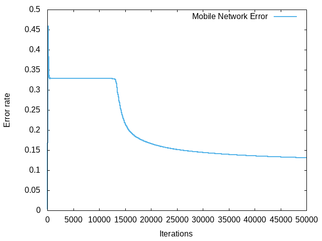
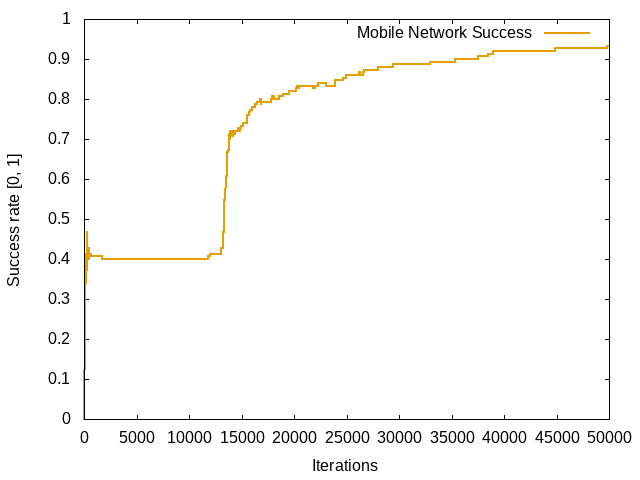
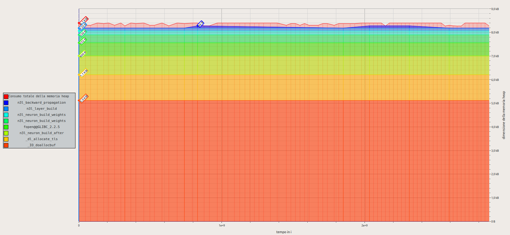
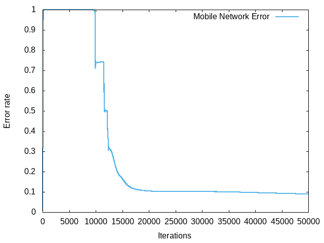
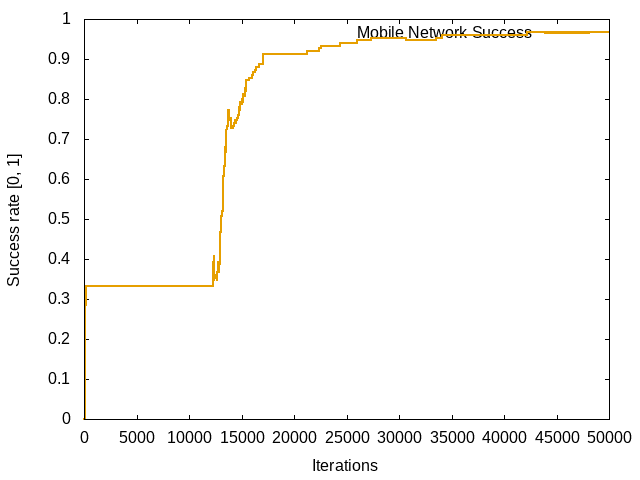
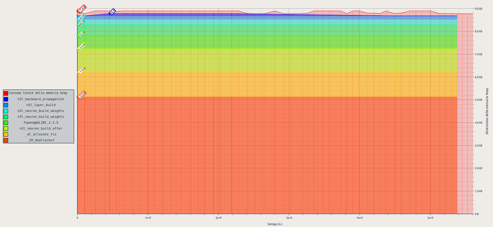

# N3L Example - IRIS

## Description
A common example of use neural network to classificate the inputs to a recognized pattern.
Data set and description reference: https://archive.ics.uci.edu/ml/datasets/Iris

It's designed with the idea that each output neuron give the probabily about each of the three possibily classification.

| Name | Case ID |
|------|---------|
| Iris-virginica | 0 |
| Iris-setosa | 1 |
| Iris-versicolor | 2 |

# Reports
## IRIS - Report
### Report ID: 858fb2a4-e989-4856-b007-1bb708144349

### Configuration

| Conf              | Value          |
|-------------------|----------------|
| Iterations        | `50000`     |
| Learning Rate     | `0.05`          |
| Input Neurons     | `4`          |
| Hidden Layers     | `1`          |
| Hidden 0 - Neurons    | `3`          |
| Output Neurons    | `3`          |
| Input Act         | `None`       |
| Hidden 0 - Act        | `Sigmoid`    |
| Output Act        | `Sigmoid`    |
| **Extra Args**    | `` |

### Learning Graph
- **MNS:** It's the Mobile Network Success rate. Range from 0 to 1. Higher is better.
- **MNE:** It's the Mobile Network Error rate. Lower is better.

### Memory Usage Graph
Memory usage was evaluated by _massif_ tool.

### Execution Time

| Mode                 | Time ( seconds )   |
|----------------------|--------------------|
| Forward Propagation  | `11.176395536`  |
| Backward Propagation | `13.169245450` |
## IRIS - Report
### Report ID: 63e0bcb3-01f0-414c-b8dd-be4edcce0dbb

### Configuration

| Conf              | Value          |
|-------------------|----------------|
| Iterations        | `50000`     |
| Learning Rate     | `0.01`          |
| Input Neurons     | `4`          |
| Hidden Layers     | `2`          |
| Hidden 0 - Neurons    | `3`          |
| Hidden 1 - Neurons    | `3`          |
| Output Neurons    | `3`          |
| Input Act         | `None`       |
| Hidden 0 - Act        | `Swish`    |
| Hidden 1 - Act        | `Swish`    |
| Output Act        | `Swish`    |
| **Extra Args**    | `` |

### Learning Graph
- **MNS:** It's the Mobile Network Success rate. Range from 0 to 1. Higher is better.
- **MNE:** It's the Mobile Network Error rate. Lower is better.

### Memory Usage Graph
Memory usage was evaluated by _massif_ tool.

### Execution Time

| Mode                 | Time ( seconds )   |
|----------------------|--------------------|
| Forward Propagation  | `15.086868480`  |
| Backward Propagation | `18.545450527` |
