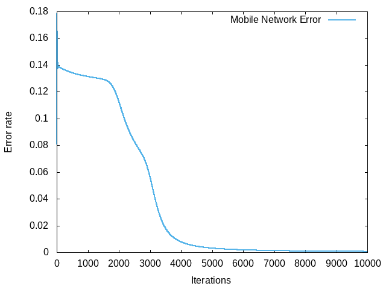
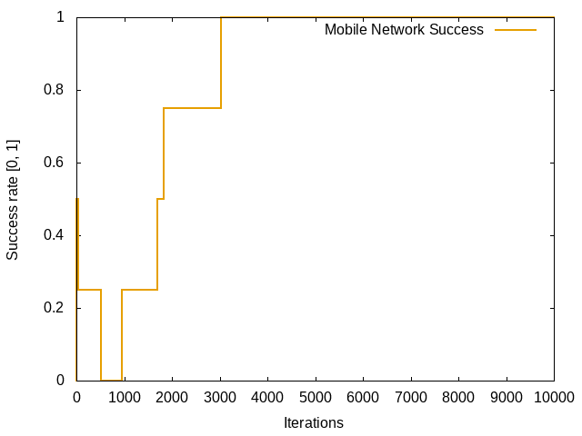
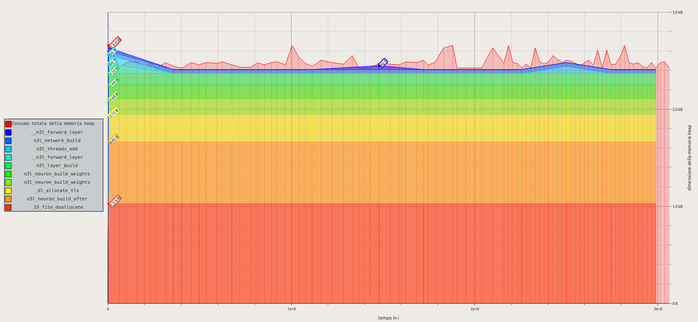

# N3L Example - XOR

## Description
This is the most common example provided by various resources online when they explain how a neural network works.

# Reports

## XOR - Report
### Report ID: bbc4695d-d278-455d-858b-25ac89f1e1fd

### Configuration

| Conf              | Value          |
|-------------------|----------------|
| Iterations        | `10000`     |
| Learning Rate     | `1.0`          |
| Input Neurons     | `2`          |
| Hidden Neurons    | `3`          |
| Hidden Layers     | `1`          |
| Output Neurons    | `1`          |
| Input Act         | `None`       |
| Hidden Act        | `Sigmoid`    |
| Output Act        | `Sigmoid`    |
| **Extra Args**    | `-b 0.5`     |

### Learning Graph
- **MNS:** It's the Mobile Network Success rate. Range from 0 to 1. Higher is better.
- **MNE:** It's the Mobile Network Error rate. Lower is better.

### Memory Usage Graph
Memory usage was evaluated by _massif_ tool.

### Execution Time

| Mode                 | Time ( seconds )   |
|----------------------|--------------------|
| Forward Propagation  | `1.290904018`  |
| Backward Propagation | `1.239838196` |
